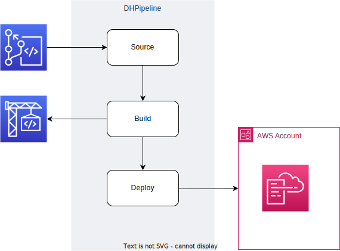

# DHPipeline


This CDK construct will create a CI/CD pipeline.  :smile:

The intention is to provide a flexible construct that can be configured and instantiated easily to support a number of different project types, branching strategies, code commit repositories, deployment strategies and pluggable stages.

## Usage

### :construction_worker: Provide the configuration

Defaults to .pipeline-config.yaml

```
projectName: <project name>
projectType: Cloudformation | CDK
codeRepositoryName: <your code repo name>
codeRepositoryBranch: <your branch>
```

### :construction: Create an instance of the pipeline

```test
import { App } from 'aws-cdk-lib';
import { DHPipeline } from './DHPipeline';

const app = new App();
// const stack = new cdk.Stack(app, 'MyTestPipelineStack');
DHPipeline.createPipeline(app);

```

## :large_blue_circle: ProjectType - Cloudformation

The following are specific details for the Cloudformation project type:



Currently your repository branch needs to include the following files:
- buildspec.yaml - specifies the command to run in the build phase
- template.yaml - specifies the infrastructure you wish to be deployed via a cloudformation script

### :green_book: To Do

- [ ] Provide default buildspec
- [ ] Confirm behaviour if the required files are not present in the repository
- [ ] Allow for multiple cloudformation stacks
- [ ] plus others...

## :large_blue_circle: ProjectType - CDK

The following are specific details for the CDK project type:

- [ ] Not yet implemented